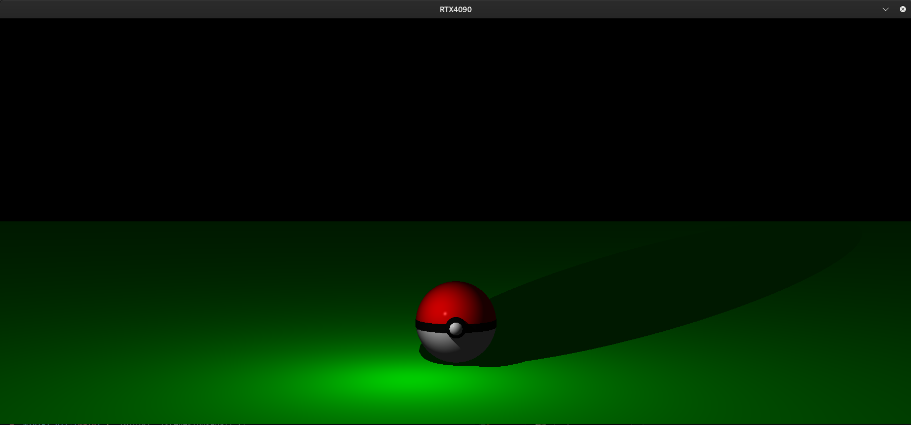

<h1 align="center">
	miniRT
</h1>

<p align="center">
	<b><i>A basic implementation of a Raytracing Engine</i></b><br>
</p>

---


### More Images at the End

## Description
Summary: This project is an introduction to the beautiful world of Raytracing.
The "miniRT" is my ray tracing engine coded in entirely in C using only the minilibx library (for providing for creating windows and drawing pixels) adhering to norminette.

## Raytracing
Ray tracing is a rendering technique that can produce incredibly realistic lighting effects.
Essentially, an algorithm can trace the path of light, 
and then simulate the way that the light interacts with the virtual objects it ultimately hits in the computer-generated world.


To pull files ↙️
```bash
git clone git@github.com:fredch16/miniRT.git
```
To compile the program ↙️

```bash
$ make
```
To load you have to launch the program with a valid .rt scene file as a parameter 🗺️
```bash
$ ./miniRT ./scenes/scene.rt
```

There are some scenes in the `scenes` folder that showcase miniRT's capabilities.

## Definitions

Ambient lighting:	`A {ratio} {color}`
* Ambient lighting ratio in range [0.0,1.0].
* R,G,B colors in range [0-255].

Camera:	`C {position} {orientation} {FOV}`
* x,y,z coordinates of the view point.
* A vector with the the x,y,z axis in the range [-1,1].
* Horizontal field of view in degrees in range [0,180].

Light:	`L {position} {ratio} {color}`
* x,y,z coordinates of the light point.
* The light brightness ratio in range [0.0,1.0].
* R,G,B colors in range [0-255].

Sphere:	`sp {position} {diameter} {color}`
* x,y,z coordinates of the sphere center.
* The sphere diameter.
* R,G,B colors in range [0-255].

Plane:	`pl {position} {orientation} {color}`
* x,y,z coordinates.
* A vector with the the x,y,z axis in the range [-1,1].
* R,G,B colors in range [0-255].

Cylinder:	`cy {position} {orientation} {diameter} {height} {color} {caps}`
* x,y,z coordinates for the cylinder center.
* A vector with the the x,y,z axis in the range [-1,1].
* The cylinder diameter.
* The cylinder height.
* R,G,B colors in range [0-255].
* Toggle Cylinder Caps [0/1].

## Images of the Project





